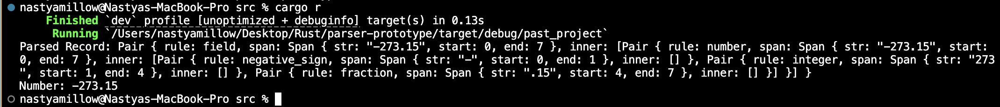

# parser-prototype

### Overview

This is a simple Rust program that uses the pest parsing library to parse numerical fields from strings. The program demonstrates how to parse numbers, including negative and decimal numbers, and output the parsed value.

### Files

main.rs: The main Rust source file containing the program logic.
grammar.pest: The pest grammar file defining the parsing rules.

### Setup

1.	Clone the repository or download the files to your local machine.
2.	Add dependencies to your Cargo.toml file:

```toml
[dependencies]
pest = "2.1"
pest_derive = "2.1"
anyhow = "1.0"
```

